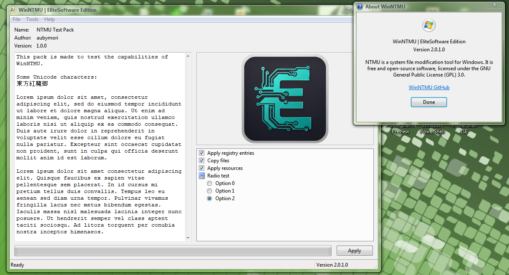
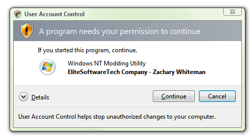

# WinNTMU (Windows NT Modding Utility) EliteSoftware Edition

THIS IS A FORK (I Will still include all links to original Repo / Packs) The Windows NT Modding Utility is a modding tool for windows, similar to the 7even Theme Source Patcher (7TSP), but including a different feature set.

## Features

- Replacing/adding resources in executable files
- Copying/replacing files
- Importing registry entries
- Doesn't mess with permissions, performs operations as TrustedInstaller
- Author-defined pack options that the user can change before applying the pack

## Get packs

You can get packs at:

## [NTMU Official Dedicated Site](https://get-ntmu.github.io/#!/packs).

## [EliteSoftware WinNTMU Packs](https://github.com/TheShadyRainbow4/WinNTMU_Packs-EliteSoftware).

## Create packs

You can learn the pack format specification at 

## [NTMU Official Wiki](https://github.com/get-ntmu/NTMU/wiki).

## [WinNTMU EliteSoftware Fork Repo](https://github.com/TheShadyRainbow4/Windows_NT_Modding_Utility-FORK).
