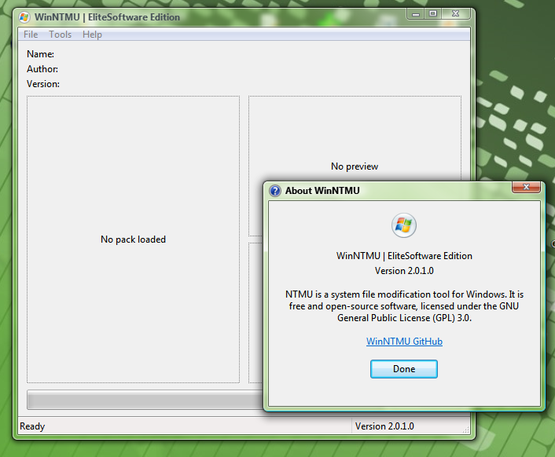

# WinNTMU (Windows NT Modding Utility) EliteSoftware Edition

THIS IS A FORK (I Will still include all links to original Repo / Packs) The Windows NT Modding Utility is a modding tool for windows, similar to the 7even Theme Source Patcher (7TSP), but including a different feature set.

## 🚀 EliteSoftware Edition Features

- **Automated Reverse Packs**: Automatically creates a mirrored backup "Reverse Pack" before installing, preserving the original folder structure of replaced files and backing up modified registry keys. Can also be triggered via the Tools menu.
- **Drag & Drop ZIP Support**: Drag and drop `.zip` files or raw folders directly into the utility. ZIPs are automatically extracted and loaded.
- **Persistent Window Size**: WinNTMU remembers its exact window dimensions and position between launches via the registry.
- **UAC Shield & UIPI Bypass**: Fully bypasses UIPI to allow drag-and-drop from un-elevated apps into the elevated window. Includes proper UAC shield iconography.
- **Persistent Logging & Status Bar**: All outputs are logged continuously to `WinNTMU.log` in the application directory. Includes a handy "View WinNTMU Logs" link right in the status bar.
- **Audio Cues**: Plays a classic `Complete.wav` success sound after a successful pack installation.
- **Polished About Dialog**: Fully centered About dialog layout with legacy Windows Information and Help icon support.
- **Automated CI/CD**: Automatically bumps versions, compiles, cryptographically signs via `Elite-EasySigner`, and publishes binaries directly to GitHub Releases.

## Core Features

- Replacing/adding resources in executable files
- Copying/replacing files
- Importing registry entries
- Doesn't mess with permissions, performs operations as TrustedInstaller
- Author-defined pack options that the user can change before applying the pack

## Get packs

You can get packs at:

## [NTMU Official Dedicated Site](https://get-ntmu.github.io/#!/packs).

## [EliteSoftware WinNTMU Packs](https://github.com/TheShadyRainbow4/WinNTMU_Packs-EliteSoftware).

## Create packs

You can learn the pack format specification at 

## [NTMU Official Wiki](https://github.com/get-ntmu/NTMU/wiki).

## [WinNTMU EliteSoftware Fork Repo](https://github.com/TheShadyRainbow4/Windows_NT_Modding_Utility-FORK).
